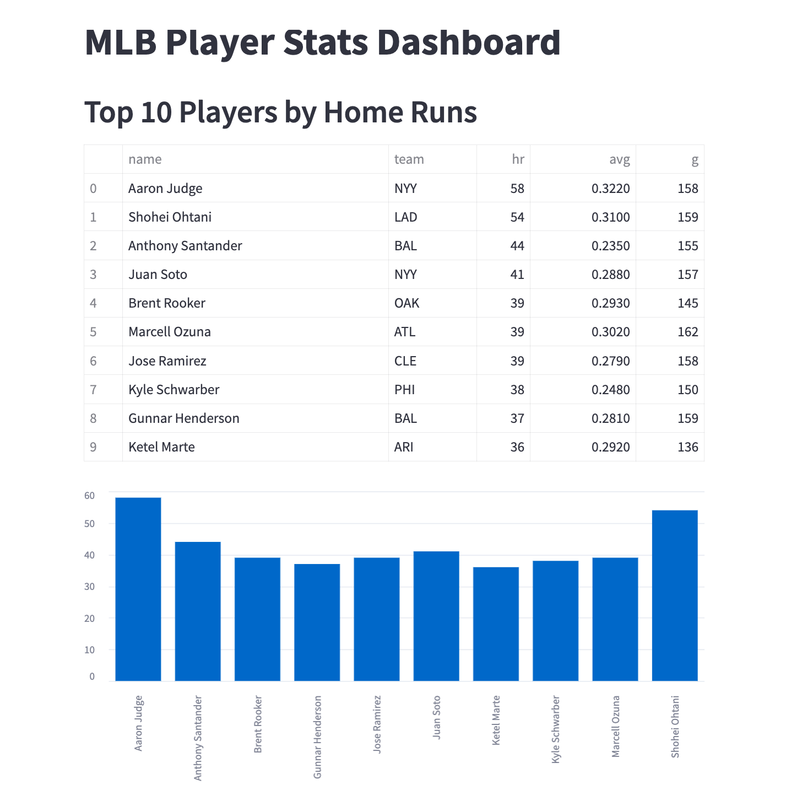
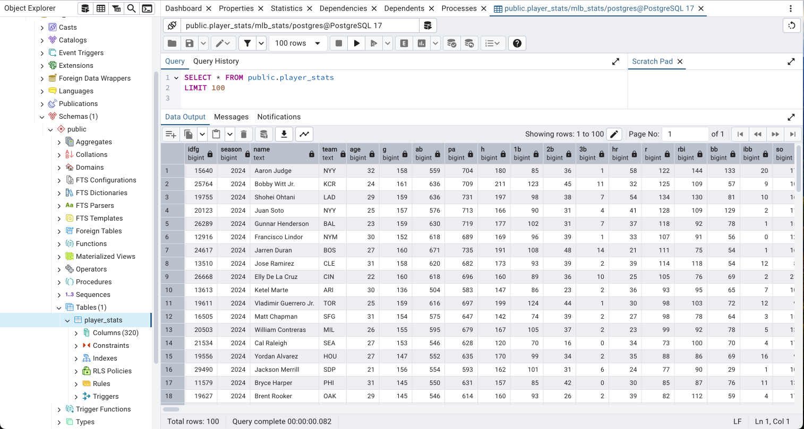

# MLB Stats Pipeline 🚀

An automated data pipeline that fetches, processes, and analyzes MLB player statistics. The project includes:

- Python scripts to fetch and clean data using `pybaseball`
- PostgreSQL for data storage
- Streamlit dashboard for data visualization

## Features
- Fetches MLB stats automatically using `pybaseball`
- Stores data in a PostgreSQL database
- Visualizes top player stats in an interactive Streamlit dashboard

## Setup Instructions
### Prerequisites
- Python 3.11.5
- PostgreSQL
- Virtual environment (optional but recommended)

### Installation
1. Clone this repository:
   >> git clone https://github.com/your-username/mlb-stats-pipeline.git
   >> cd mlb-stats-pipeline
   
2. Install the required Python packages
   >> pip install -r requirements.txt
   
3. Set up the PostgreSQL database:
  >> psql -U your_username
  >> CREATE DATABASE mlb_stats;

4. Run the script to fetch and process data:
  >> python main.py

5. Start the Streamlit dashboard:
  >> streamlit run dashboard.py

---

## Usage
Visit the Streamlit dashboard at [http://localhost:8501](http://localhost:8501) to:
- View top players by home runs
- Analyze batting averages and more

## Screenshots
### Streamlit Dashboard

### PostgreSQL Database

## Project Architecture

This project is organized as follows:
- **Data Fetching**: Uses `pybaseball` to gather player statistics.
- **Data Storage**: Stores the cleaned data in a PostgreSQL database.
- **Visualization**: Provides interactive visualizations using Streamlit.

## Future Enhancements
- Deploy the Streamlit app to a cloud platform (e.g., Streamlit Cloud, AWS)
- Add advanced data visualizations and player insights
- Introduce machine learning to predict player performance

## License
This project is licensed under the MIT License. See `LICENSE` for details.
